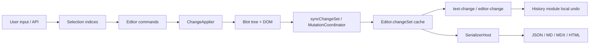
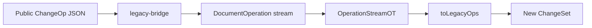
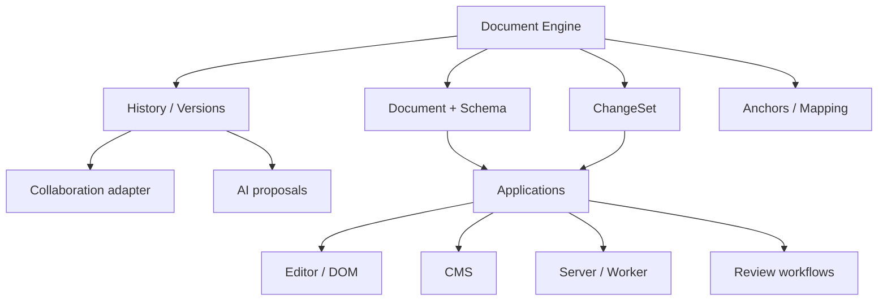

# Lextrix Document Engine — Architecture Discovery Report

> **Historical document (Phase 0 discovery, 2026-09-14).**  
> The executive summary below describes Lextrix **before** Phases 1–7. It is preserved for project history.  
> **Current architecture:** see [TRANSFORMATION-PROGRESS.md](./TRANSFORMATION-PROGRESS.md), [ADR index](./adr/README.md), [wire-format.md](./wire-format.md), [api-stability.md](./api-stability.md), [experimental-document.md](./experimental-document.md).  
> As of Phase 7, Lextrix has a headless Document/Version/Proposal engine, Hybrid B+ projection, intelligence provider boundary, and **Accepted ADR-012 wire contracts**.

**Status:** Discovery complete (historical) — subsequent phases implemented separately  
**Date:** 2026-09-14  
**Audience:** Technical owners planning the programmable document-engine transformation  
**Companion:** [Transformation progress tracker](./TRANSFORMATION-PROGRESS.md)

---

## Executive summary

> **(Phase 0 snapshot — do not treat as current state.)**

Lextrix today is a **strong Quill-shaped rich-text editor** with a **real OT ChangeSet spine**. That ChangeSet layer is the project’s most valuable asset for the long-term vision.

The live document truth, however, is still the **blot / DOM tree**. `ChangeSet` is a cache and wire format, not a headless authoritative document. There is **no** transaction API, **no** version/branch model, **no** stable anchors, **no** collaboration session layer, and **no** AI-as-ChangeSet pathway.

**First milestone (do not skip ahead):** make the document model and ChangeSet engine strong enough that editor, history, collaboration, and AI can eventually share the same primitives — without rewriting the working editor surface.

**Principle to keep visible:**

```text
EVERYTHING IS A CHANGE
```

---

## A. Current architecture map

### Packages (as implemented)

| Package | Role today | DOM required? | Published? |
|---------|------------|---------------|------------|
| `lextrix-change` | ChangeSet OT (`compose` / `diff` / `transform` / `invert`) | No | No (workspace) |
| `lextrix-serialize` | MD / MDX / JSON / HTML ↔ ChangeSet | HTML needs editor adapter | No (workspace) |
| `lextrix-dom` | Blots, registry, MutationObserver sync | Yes at blot construction | No |
| `lextrix-core` | Editor shell, selection, PluginHost, contracts | Yes when editor runs | No |
| `lextrix-formats` | Built-in formats | Via blots | No |
| `lextrix-modules` | Keyboard, clipboard, history, toolbar, … | Yes | No |
| `lextrix-themes` / `lextrix-ui` | Themes + toolbar chrome | Yes | No |
| `lextrix` | Published ESM+UMD+CSS bundle | Browser product | **Yes** |
| `@lextrix/react` | React mount/teardown wrapper | Client DOM | **Yes** |

### Dependency DAG

```mermaid
flowchart TB
  change[lextrix-change]
  serialize[lextrix-serialize]
  dom[lextrix-dom]
  core[lextrix-core]
  formats[lextrix-formats]
  modules[lextrix-modules]
  ui[lextrix-ui]
  themes[lextrix-themes]
  bundle[lextrix npm]
  react[@lextrix/react]

  change --> serialize
  change --> core
  dom --> core
  serialize --> core
  core --> formats
  core --> ui
  core --> modules
  formats --> modules
  dom --> modules
  change --> modules
  core --> themes
  formats --> themes
  modules --> themes
  ui --> themes
  change --> bundle
  core --> bundle
  dom --> bundle
  formats --> bundle
  modules --> bundle
  serialize --> bundle
  themes --> bundle
  ui --> bundle
  bundle --> react
```

### Data / mutation / rendering flow (today)



Evidence:

- Live apply path: `packages/core/src/core/change-applier/change-applier.ts` mutates `Scroll`.
- Cache reconcile: `packages/core/src/core/change-sync/change-sync.ts` and `Editor.changeSet` in `packages/core/src/core/editor.ts`.
- History: local stack in `packages/modules/src/modules/history.ts` (`invert` + `updateContents`).
- No `transaction` / `DocumentSnapshot` / `branch` APIs in packages (verified by search).

### Three coexisting “document” representations

1. **ChangeSet ops** — Quill-compatible JSON (`insert` / `delete` / `retain` + attributes). DOM-free. Public.
2. **Blot tree** — authoritative live structure for editing. DOM-backed.
3. **`DocumentNode`** — thin identity still carrying `domNode: Node | null` (`packages/dom/src/dom/document/document-node.ts`). Not a headless content model.

### ChangeSet internals



- Public builders mutate (`push` / `chop`); `clone()` / `freeze()` exist (2.1.0).
- Native `DocumentOperation` is **not exported** from `lextrix-change` (`packages/change/src/index.ts` exports only ChangeSet surface).
- Property-based OT fuzz for compose/transform/invert is **thin** (unit tests exist; no dedicated algebra fuzz suite).

### Serialization boundary (already correct direction)

```text
Canonical intent today: ChangeSet JSON
        │
 ┌──────┼──────────┐
 ↓      ↓          ↓
HTML* Markdown    MDX / JSON

* HTML import/export requires live editor adapter (clipboard / getSemanticHTML)
```

---

## B. Strengths (preserve)

| Asset | Why keep it |
|-------|-------------|
| **ChangeSet OT spine** | DOM-free package; compose/diff/transform/invert; Quill-compatible wire shape |
| **Serialize ↔ ChangeSet** | MD/MDX/JSON headless; safety warnings; explicit lossy matrix |
| **Module contracts in core** | DIP already started (`KeyboardModule`, …); modules implement, core does not import them |
| **PluginHost lifecycle** | `destroyAll` + `Module.listenDom` / `onEditor` / `track` |
| **Lazy document listeners** | Refcounted on construct/destroy — not import-time |
| **Framework split** | `@lextrix/react` is a consumer, not the core |
| **Registry / ExtensionHost** | Extension path exists without forking the bundle |

---

## C. Weaknesses (relative to document-engine north star)

| Weakness | Evidence | Impact |
|----------|----------|--------|
| Live truth is blot/DOM | `ChangeApplier` + `Scroll`; `DocumentNode.domNode` | Blocks Node/worker/AI headless editing |
| No transactions | Mutations via `modify()` / direct APIs | Blocks labeled AI batches, review accept/reject |
| History is local-only | `History.stack` in modules | Not shared versions / collab |
| No anchors / mapping API | Indices via `DocumentIndexMapper` tied to DOM | Comments/AI suggestions will drift |
| Dual op model | Public `ChangeOp` vs private `DocumentOperation` | Collaboration protocol / versioning risk |
| HTML-default React controlled mode | `@lextrix/react` default `format: 'html'` | Encourages editor-bound round-trips |
| Bundle side-effect registration | Full `lextrix` entry registers everything | Harder slim/server entry |
| Thin OT property tests | change package unit tests only | Correctness risk as we lean harder on OT |
| No benchmarks except serialize | `scripts/bench-serialize.mjs` | Performance regressions invisible |

---

## D. Architectural risk register

| ID | Risk | Severity | Notes |
|----|------|----------|-------|
| R1 | Blot/DOM remains sole live document | **Critical** | Vision blocked until headless document exists *or* ChangeSet becomes apply-authoritative without DOM |
| R2 | Premature rewrite of blot layer | **Critical** | Working editor; rewrite without migration = product death |
| R3 | Dual ChangeOp / DocumentOperation drift | **High** | Wire protocol and OT correctness |
| R4 | History ≠ version graph | **High** | Undo stack will be confused with document history |
| R5 | Multiple position systems later | **High** | Comments vs AI vs selection if built separately |
| R6 | AI mutates editor DOM / `setContents` directly | **High** | Loses undo/diff/audit |
| R7 | Collab hard-coded to one algorithm too early | **Medium** | Abstract sync boundary first |
| R8 | Package rename avalanche | **Medium** | Aesthetic splits without responsibility clarity |
| R9 | Public API churn (deprecated leftovers) | **Medium** | `import`/`export`, `theme.modules` |
| R10 | Performance cliff on large docs | **Medium** | No editor OT benchmarks yet |

---

## E. Target architecture map



### Conceptual layering (target)

```text
@lextrix/change      — OT primitive (largely exists as lextrix-change)
@lextrix/model       — headless Document + apply(ChangeSet)   [NEW responsibility]
@lextrix/history     — versions / snapshots / revert          [NEW]
@lextrix/anchor      — positions that survive changes         [NEW]
@lextrix/serialize   — exists (lextrix-serialize)
@lextrix/editor      — DOM blot view + input (today's core+dom+modules)
@lextrix/react       — exists
@lextrix/collab      — later
@lextrix/ai          — later (ChangeSet proposals only)
```

**Do not rename packages for aesthetics.** Map responsibilities first; split only when a package has two owners.

---

## F. Gap analysis

| Capability | Today | Gap |
|------------|-------|-----|
| Headless ChangeSet OT | Strong | Property/fuzz invariants |
| Headless live document | Missing | Document that `apply(change)` without DOM |
| Transactions | Missing | `transaction()` → ChangeSet commit |
| Versions / snapshots | Missing | History ≠ undo stack |
| Branch / merge | Missing | Must not paint into corner |
| Anchors | Missing | Mapping through ChangeSets |
| Collab | Missing | Session + transform pipeline |
| AI | Missing | Proposal object = ChangeSet + metadata |
| Editor | Strong | Becomes a consumer of Document |
| Serialize | Strong for MD/JSON | Keep as boundary |

---

## G. Proposed package structure (evolutionary)

| Near-term (keep names) | Responsibility |
|------------------------|----------------|
| `lextrix-change` | Strengthen; export clearer contracts; OT property tests |
| `lextrix-serialize` | Unchanged role |
| `lextrix-core` | Split *conceptually*: editor shell vs future document host |
| `lextrix-dom` | Rendering/input boundary only (long-term) |
| New module folder or package when ready | `Document` / `Transaction` / `Snapshot` APIs |

Only after APIs stabilize: publish `@lextrix/model` (or keep under `lextrix` subpath `lextrix/model`).

---

## H. Core type / interface proposal (design only — not implemented)

Names may adapt to existing vocabulary; invariants matter more than branding.

```ts
// Target shapes — discovery proposal, not shipped API

interface DocumentSnapshot {
  readonly id: string;
  readonly contents: ChangeSet; // or frozen ops
  readonly version: number;
}

interface Document {
  snapshot(): DocumentSnapshot;
  getContents(): ChangeSet;
  apply(change: ChangeSet, meta?: ChangeMeta): DocumentSnapshot;
  transaction(): DocumentTransaction;
  on(event: 'change', handler: (e: DocumentChangeEvent) => void): void;
}

interface DocumentTransaction {
  insert(index: number, value: string | object, attributes?: object): this;
  delete(index: number, length: number): this;
  format(index: number, length: number, attributes: object): this;
  commit(meta?: ChangeMeta): ChangeSet;
  abort(): void;
}

interface ChangeMeta {
  source: 'user' | 'api' | 'ai' | 'remote' | 'system';
  authorId?: string;
  intent?: string;
}

interface Anchor {
  readonly id: string;
  mapThrough(change: ChangeSet): Anchor;
  toRange(doc: Document): { index: number; length: number } | null;
}

interface ChangeProposal {
  change: ChangeSet;
  explanation?: string;
  metadata: ChangeMeta;
  // accept => document.apply(proposal.change)
}
```

**Invariant:** AI and remote peers only produce `ChangeSet` / `ChangeProposal`. They never call blot APIs.

---

## I. Migration sequence (safe)

```text
PHASE 0  Discovery + progress tracking          ← YOU ARE HERE
PHASE 1  ChangeSet correctness + formal tests
PHASE 2  Headless Document apply(ChangeSet) over ops
         (blot editor remains; dual-write or adapter)
PHASE 3  Transactions producing ChangeSets
PHASE 4  Snapshots / linear versions (not Git yet)
PHASE 5  Anchors + mapping
PHASE 6  Collab adapter boundary
PHASE 7  AI proposals
PHASE 8  Hosted / cloud (explicitly later)
```

**Minimum unlock for the vision (Phase 1–2):**

1. Prove OT invariants with property/fuzz tests.  
2. Introduce a **DOM-free Document** whose state is ChangeSet (or equivalent ops) and whose only mutation API is `apply(change)`.  
3. Teach the editor to **project** that document into blots (DOM as view), gradually inverting today’s “blots own truth”.

Do **not** delete the blot system in Phase 1.

---

## J. Testing strategy

| Layer | Action |
|-------|--------|
| Unit | Expand change OT cases |
| Property | `compose` associativity; transform convergence; invert round-trips |
| Fuzz | Random docs + random ops (extend beyond serialize fuzz) |
| Integration | `Document.apply` → serialize → re-parse |
| Browser | Keep lextrix unit/e2e for editor surface |
| Bench | ChangeSet compose/transform + large doc apply; keep serialize bench |

---

## K. Performance strategy

- Add benches: tiny / medium / large ChangeSets; compose; transform; invert; apply (headless).  
- Track: ChangeSet size, apply time, memory, bundle size, typing latency (editor).  
- No blind optimization — regressions gate releases.

---

## L. Security notes (engine era)

- Keep HTML as untrusted boundary; sanitize paste path.  
- AI-generated HTML must go through same sanitization as paste.  
- Plugins remain explicit registration — no remote code execution.  
- Trusted vs untrusted content labeled in serialize/import docs.

---

## M. 3-month implementation roadmap (proposed)

| Month | Focus | Exit criteria |
|-------|--------|---------------|
| **Month 1** | ChangeSet hardening + ADR set + headless Document spike | OT property suite green; spike `Document.apply` without DOM; ADRs accepted |
| **Month 2** | Transactions + editor adapter dual-path | Transaction → ChangeSet; editor can apply transaction result; undo still works |
| **Month 3** | Snapshots (linear) + Anchor prototype | `snapshot` / `diff(v1,v2)`; one annotation maps through edits; no collab/AI product yet |

Track live status in [TRANSFORMATION-PROGRESS.md](./TRANSFORMATION-PROGRESS.md).

---

## Explicit answers

### 1. Strongest existing architectural asset?

**`lextrix-change` (ChangeSet OT)** — DOM-free, compose/diff/transform/invert, Quill-compatible public ops, already the hub for serialization. Evidence: `packages/change`, `OperationStreamOT`, serialize depending only on change for MD/MDX/JSON.

### 2. Single biggest architectural weakness?

**Authoritative live state lives in the blot/DOM tree**, not in a headless document. `Editor.changeSet` is a cache; `ChangeApplier` mutates `Scroll`. That blocks server/worker/AI-first workflows.

### 3. What should remain unchanged?

- Public ChangeSet JSON shape (near-term)  
- OT algorithms (strengthen, don’t replace)  
- Serialize-as-boundary design  
- PluginHost / module contracts / ExtensionHost  
- Framework-agnostic core + separate React package  
- Working editor UX (toolbar, themes, modules)

### 4. What should be refactored?

- Invert dependency: Document owns state; editor projects to DOM  
- History module vs future Version store (separate concepts)  
- Export clearer change-engine APIs; reduce dual-op confusion  
- Selection indices → shared mapping primitive usable headlessly  
- Slim entry points for headless (no full theme registration)

### 5. What should eventually be removed?

- Deprecated content `import` / `export` aliases (after deprecation window → 3.x)  
- `theme.modules` legacy getter  
- Treating HTML as default “source of truth” in React apps  
- Special-case mutation paths that bypass ChangeSet  
- (Long-term) any assumption that `DocumentNode` requires `domNode`

### 6. What should become the canonical document model?

A **headless `Document`** whose content is represented as **ChangeSet (ops) + schema/format registry metadata**, with optional projection to blots for editing. Not HTML, not Markdown, not the live DOM tree.

### 7. Is ChangeSet strong enough to be the foundation?

**Yes, as the change primitive** — with work: formal invariants, property/fuzz tests, clearer immutability story for shared docs, and a Document that applies ChangeSets without DOM. It is **not** yet a full document database (no versions/branches/anchors).

### 8. Required for robust collaboration?

- Shared apply pipeline using `transform`  
- Presence/cursors as mapped positions  
- Server or CRDT adapter behind a sync boundary (don’t hard-code one)  
- Replace local-only History with versioned change log for sync  
- Tests for concurrent transform convergence

### 9. Required for AI-generated changes?

- `ChangeProposal { change, explanation, metadata }`  
- Apply only via `document.apply` / transaction commit  
- Accept/reject without privileged DOM writes  
- Source tagging (`ai`) in history  
- Prefer JSON/ChangeSet I/O over HTML round-trips

### 10. Required for document versioning?

- Immutable snapshots (structural sharing later)  
- Linear version chain first; branch/merge later  
- `diff(vA, vB)` via ChangeSet.diff  
- Do **not** overload `History` undo stack as versions

### 11. What should package boundaries become?

Keep current names near-term. Evolve responsibilities toward: **change / model / history / anchor / serialize / editor / react / collab / ai**. Split packages only when ownership is clear.

### 12. What should the public API eventually look like?

```ts
const doc = createDocument({ contents })
const tx = doc.transaction()
tx.insert(0, 'Hello')
const change = tx.commit({ source: 'user' })
doc.apply(change)

const editor = createEditor({ document: doc, root })
// AI
const proposal = await ai.rewrite({ document: doc, range, instruction })
doc.apply(proposal.change, proposal.metadata)
```

Editor remains; it is no longer the only entry point.

### 13. What should we build in the next 30 days?

1. ADR set (model, ChangeSet, DOM boundary, serialization)  
2. ChangeSet property/fuzz invariant suite  
3. Headless `Document` spike: `getContents` / `apply` / events — no DOM  
4. Progress tracker updates weekly  
5. **Do not** ship collab, AI product, or package renames yet

### 14. What should we explicitly NOT build yet?

- Lextrix Cloud / hosted infra  
- Notion-like databases/tasks/chat  
- Full CRDT stack  
- Full Git-like branch UI  
- Toolbar feature parity chases  
- Rewriting blot DOM from scratch  
- Marketing repositioning before architecture supports claims

### 15. Minimum architectural change to unlock the long-term vision?

**Introduce a headless Document whose sole mutation path is applying ChangeSets, and make the editor a projector of that Document — while keeping ChangeSet OT as the shared language for human, remote, and AI edits.**

That single inversion (blots-as-view vs blots-as-truth) unlocks transactions, versions, anchors, collab, and AI without redesigning each feature separately.

---

## Decision gate

Implementation of production code for this transformation starts only after:

1. This report is accepted (or amended) by the project owner.  
2. ADRs for Phase 1 are drafted under `docs/architecture/adr/`.  
3. Progress tracker milestones for Month 1 are checked off or explicitly deferred.

**Next step after acceptance:** Phase 1 — ADR-001..003 + ChangeSet invariant tests + Document spike (behind experimental API).
